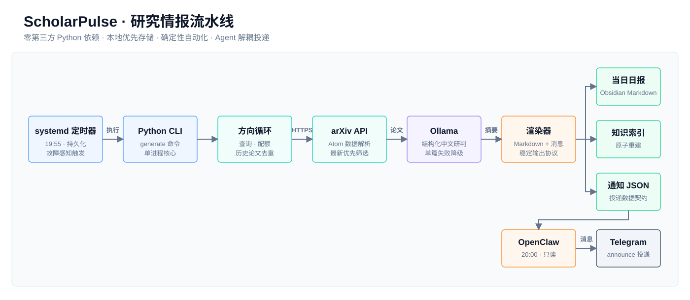
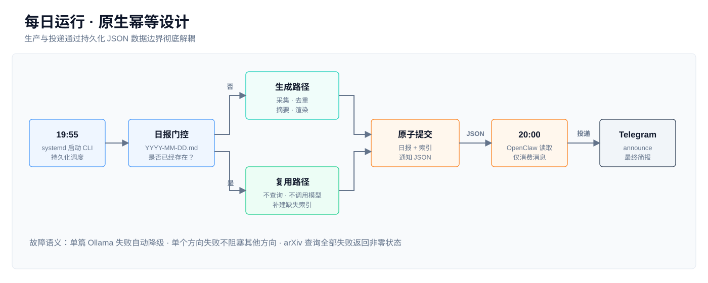

# ScholarPulse

> 面向个人知识库的本地优先研究情报流水线：自动捕获前沿论文，生成结构化中文研判，并以可审计的数据契约完成知识沉淀与消息投递。

[English](README_EN.md)

`ScholarPulse` 将 arXiv、Ollama、Obsidian、systemd 与 OpenClaw 组合成一条稳定、克制、可迁移的自动化链路。核心由 Python 标准库驱动，不依赖第三方 Python 包，不要求 venv，也不把 Agent 或 MCP 嵌入确定性的生产流程。

```text
LOCAL-FIRST  ·  ZERO THIRD-PARTY PYTHON DEPS  ·  MULTI-DIRECTION  ·  IDEMPOTENT  ·  ATOMIC WRITE
```



## 核心能力

| 能力 | 实现 |
| --- | --- |
| 多方向监测 | 每个研究方向独立配置查询、配额、日报目录和索引 |
| 最新论文捕获 | 直接访问 arXiv Atom API，按提交时间倒序筛选 |
| 跨版本去重 | 将 `2606.12345v1`、`v2` 归一为同一论文 |
| 结构化研判 | Ollama 输出一句话结论、核心内容、方法与数据、价值判断 |
| 优雅降级 | 单篇模型调用失败时保留元数据、英文摘要和固定中文结构 |
| 原子落盘 | 临时文件写入后使用原子替换，避免产生半份日报 |
| 自动索引 | 从现有日报重建概览、日报表和去重清单 |
| 稳定投递契约 | 额外生成通知 JSON，OpenClaw 无需重新解析 Markdown |
| 系统级调度 | systemd 负责生产，OpenClaw 只负责 Telegram 投递 |

## 设计原则

### 确定性核心

查询、去重、摘要、渲染和写入全部由 Python CLI 明确执行。核心链路不依赖 Agent 的临场判断，因此行为可复现、错误可定位、退出状态可监控。

### Agent 解耦

OpenClaw 不生成日报、不调用 CLI、不通过 MCP 重新读取 Obsidian。它只读取 Python 产出的 `message` 字段并交给 Gateway announce。

### 本地知识主权

日报和索引直接写入本地 Obsidian Vault。没有中间数据库，没有额外 Web 服务，也没有隐式云端状态。

### 配置驱动扩展

增加一个研究方向只需增加一段配置，不需要复制脚本、创建新任务或修改工作流代码。

## 运行时拓扑



当前生产节奏：

```text
19:55  systemd 启动 Python CLI
       ├─ 当日日报不存在：查询、去重、摘要、写日报和索引
       └─ 当日日报已存在：跳过查询与模型调用，必要时补建索引

20:00  OpenClaw 读取通知 JSON
       └─ Gateway Telegram announce
```

五分钟窗口将“生产”和“投递”彻底分开。即使 OpenClaw 暂时不可用，日报与索引仍会正常生成；投递层也不会反向影响核心任务。

## 快速开始

运行要求：

- Python 3.11+
- 可访问 `export.arxiv.org`
- 可选的 Ollama 服务
- 一个可写的本地目录或 Obsidian Vault

直接运行：

```bash
python3 scholarpulse.py generate --config config.json
```

也可以使用仓库提供的轻量命令入口：

```bash
./bin/scholarpulse generate --config config.json
```

安装到本机后的统一命令：

```bash
~/bin/scholarpulse generate
```

包装器只负责定位 Python CLI 和默认配置，不承载任何业务逻辑。

## 多方向配置

```json
{
  "tls": {
    "verify": true,
    "ca_file": ""
  },
  "ollama": {
    "enabled": true,
    "base_url": "http://127.0.0.1:11434",
    "model": "qwen3:30b",
    "temperature": 0.2
  },
  "result_dir": "~/.local/state/scholarpulse/results",
  "directions": [
    {
      "name": "AI Agent",
      "daily_dir": "~/Vault/科研/AI-Agent",
      "index_file": "~/Vault/科研/AI-Agent.md",
      "knowledge_dir": "科研/AI-Agent",
      "limit": 2,
      "queries": [
        "all:\"AI agent\" OR all:\"LLM agent\"",
        "all:\"Model Context Protocol\" OR all:\"tool use\""
      ]
    },
    {
      "name": "Astronomy",
      "daily_dir": "~/Vault/科研/Astronomy",
      "index_file": "~/Vault/科研/Astronomy.md",
      "knowledge_dir": "科研/Astronomy",
      "limit": 2,
      "queries": [
        "all:exoplanet",
        "all:Gaia AND all:astrometry"
      ]
    }
  ]
}
```

每个方向拥有独立的历史集合、日报和索引。某个方向失败不会阻塞其他方向。

### 配置字段

| 字段 | 作用 |
| --- | --- |
| `name` | 方向名称，也是 `--direction` 的选择值 |
| `queries` | 按顺序执行的 arXiv 查询表达式 |
| `limit` | 该方向每天最多收录数量 |
| `daily_dir` | 日报输出目录 |
| `index_file` | 方向索引文件 |
| `knowledge_dir` | Telegram 中展示的知识库相对路径 |
| `prompt` | 可选的方向级摘要 Prompt |
| `tags` / `category` | Obsidian frontmatter 元数据 |

相对路径以配置文件所在目录为基准；绝对路径和 `~` 均受支持。

## 数据产品

### 日报

```text
科研/ScholarPulse/YYYY-MM-DD.md
```

日报包含：

- YAML frontmatter
- 今日速览表
- 论文元数据与来源链接
- 一句话结论
- 核心内容
- 方法与数据
- 价值判断
- 折叠的英文原始摘要

### 索引

```text
科研/ScholarPulse.md
```

索引从已有日报重新计算，包含日报时间线、主题、条目数量和论文级去重清单。日报存在但索引缺失时，CLI 会直接补建索引，不重新请求 arXiv 或 Ollama。

### 通知契约

```text
~/.local/state/scholarpulse/results/YYYY-MM-DD.json
```

```json
{
  "date": "2026-06-21",
  "reports": [
    {
      "direction": "ScholarPulse",
      "status": "generated",
      "note": "科研/ScholarPulse/2026-06-21.md",
      "topics": ["AI-Agent"],
      "papers": [
        {
          "title": "Paper title",
          "link": "https://arxiv.org/abs/...",
          "summary": "一句话结论"
        }
      ]
    }
  ],
  "errors": [],
  "message": "可直接发送到 Telegram 的完整文本"
}
```

JSON 是生产层与投递层之间唯一的数据契约。Markdown 面向人类阅读，JSON 面向自动化消费，两者职责互不污染。

## CLI

```bash
# 生成当天全部方向
scholarpulse generate

# 指定配置
scholarpulse generate --config /path/to/config.json

# 指定日期
scholarpulse generate --date 2026-06-21

# 只运行一个方向
scholarpulse generate --direction ScholarPulse

# 明确覆盖当日日报
scholarpulse generate --force
```

默认不会覆盖已存在的日报。`--force` 是显式操作，适用于人工修复，不建议放入定时任务。
日期必须严格使用 `YYYY-MM-DD` 格式。

## systemd 部署

仓库提供：

```text
integrations/systemd/scholarpulse-daily.service
integrations/systemd/scholarpulse-daily.timer
```

将包装器以符号链接方式安装，使它能够解析真实仓库位置：

```bash
mkdir -p ~/bin ~/.config/systemd/user
ln -s /仓库绝对路径/bin/scholarpulse ~/bin/scholarpulse
cp integrations/systemd/scholarpulse-daily.service ~/.config/systemd/user/
cp integrations/systemd/scholarpulse-daily.timer ~/.config/systemd/user/
systemctl --user daemon-reload
systemctl --user enable --now scholarpulse-daily.timer
```

机器专用配置放在 `~/.config/scholarpulse/config.json`，也可以通过 `SCHOLARPULSE_CONFIG` 指定其他路径。

查看状态：

```bash
systemctl --user list-timers scholarpulse-daily.timer
systemctl --user status scholarpulse-daily.service
journalctl --user -u scholarpulse-daily.service -n 100 --no-pager
```

## OpenClaw 投递边界

OpenClaw Cron 在 systemd 之后运行，只执行三件事：

1. 读取当天通知 JSON。
2. 确认 `reports` 非空。
3. 原样输出 `message`，由 Gateway announce 发送到 Telegram。

它明确不执行：

- 不调用 ScholarPulse CLI
- 不查询 arXiv
- 不调用 Ollama
- 不通过 MCP 读取 Obsidian
- 不解析 Markdown

MCP 仍然适合用户与 Obsidian 的交互式操作，但不是这条自动生产链路的依赖。

## 故障语义

| 场景 | 行为 |
| --- | --- |
| 当日日报已存在 | 成功退出，不查询、不摘要、不覆盖 |
| 索引缺失 | 从现有日报补建 |
| 单个 arXiv 查询失败 | 继续尝试该方向的其他查询 |
| 全部 arXiv 查询失败 | 该方向失败，CLI 返回非零状态 |
| 单篇 Ollama 调用失败 | 使用结构化备用摘要，继续处理下一篇 |
| 一个方向失败 | 其他方向继续执行，错误写入通知 JSON |
| OpenClaw 不可用 | 日报、索引和通知 JSON 仍正常生成 |

## 项目结构

```text
scholarpulse-repro/
├── scholarpulse.py              # CLI 入口
├── workflow.py                  # 流程编排
├── config.py                    # 配置校验与路径解析
├── arxiv.py                     # 查询、解析与候选去重
├── ollama.py                    # 结构化中文摘要
├── render.py                    # 日报、索引与通知内容
├── storage.py                   # 历史 ID 与原子写入
├── text.py                      # 文本清洗和 ID 归一化
├── bin/scholarpulse             # 轻量命令包装器
├── integrations/
│   ├── systemd/                 # 生产调度
│   └── openclaw/                # 投递提示词
├── assets/                      # 中英文原生 SVG 架构图
└── tests/test_scholarpulse.py   # 单元测试
```

## 验证

```bash
PYTHONDONTWRITEBYTECODE=1 python3 -m unittest discover -s tests -v
```

测试覆盖：

- 多方向独立输出
- Ollama 失败降级
- arXiv 版本归一化去重
- 全部查询失败的退出语义
- 失败时不产生空日报
- 现有日报的索引修复
- 多方向通知 JSON 与 Telegram 文本

## 工程边界

ScholarPulse 刻意保持小型化：没有数据库、消息队列、Web 后台、插件框架或不必要的抽象层。它解决的是一条清晰的工程问题——将公开研究信息稳定地转化为本地、结构化、可持续积累的个人知识资产。

这不是一个需要持续看护的 Agent Demo，而是一条可以每天准时运行的研究基础设施。

## License

MIT
