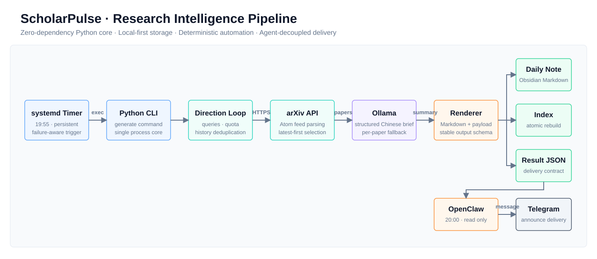
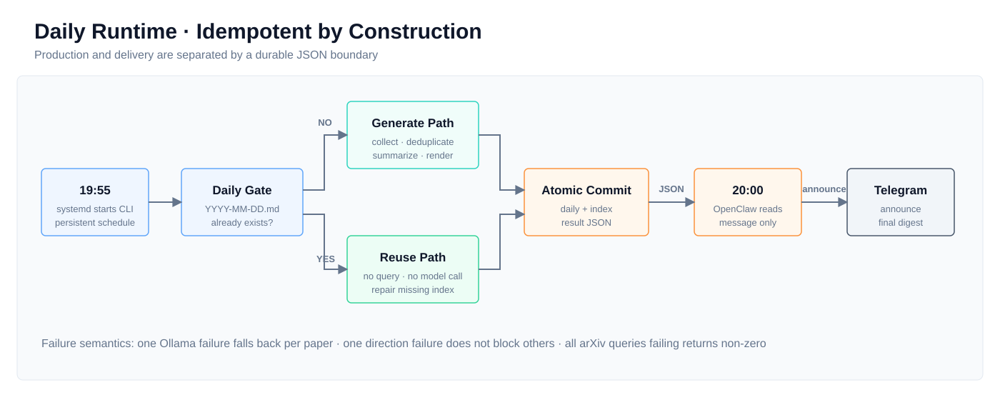

# ScholarPulse

> A local-first research intelligence pipeline that turns newly published papers into structured knowledge artifacts and delivery-ready daily briefings.

[中文](README.md)

ScholarPulse connects arXiv, Ollama, Obsidian, systemd, and OpenClaw through a deterministic Python core. It uses only the Python standard library, requires no virtual environment, and keeps Agent/MCP behavior outside the production path.

```text
LOCAL-FIRST  ·  ZERO THIRD-PARTY PYTHON DEPS  ·  MULTI-DIRECTION  ·  IDEMPOTENT  ·  ATOMIC WRITE
```



## What it does

| Capability | Implementation |
| --- | --- |
| Multi-direction monitoring | Independent queries, quotas, daily folders, and indexes per research direction |
| Latest-paper collection | Direct arXiv Atom API access with newest-first selection |
| Version-aware deduplication | arXiv revisions such as `v1` and `v2` share one identity |
| Structured analysis | Ollama produces conclusions, key points, methods, data, and value judgments |
| Graceful degradation | A failed model call falls back per paper without aborting the report |
| Atomic persistence | Temporary-file writes followed by atomic replacement |
| Rebuilt indexes | Existing daily notes remain the source of truth |
| Stable delivery contract | A JSON artifact separates production from Telegram delivery |

## Runtime model



```text
19:55  systemd starts the Python CLI
        ├─ missing daily note: collect, deduplicate, summarize, and write
        └─ existing daily note: skip network/model work and repair a missing index

20:00  OpenClaw reads the result JSON
        └─ Gateway announces its message through Telegram
```

Production and delivery are deliberately independent. A temporary OpenClaw outage cannot prevent the daily note, index, or result contract from being created.

## Quick start

Requirements:

- Python 3.11+
- Network access to `export.arxiv.org`
- An optional Ollama endpoint
- A writable local directory or Obsidian Vault

Run directly:

```bash
python3 scholarpulse.py generate --config config.json
```

Or use the repository wrapper:

```bash
./bin/scholarpulse generate --config config.json
```

## Configuration

```json
{
  "ollama": {
    "enabled": true,
    "base_url": "http://127.0.0.1:11434",
    "model": "qwen3:30b",
    "temperature": 0.2
  },
  "result_dir": "~/.local/state/scholarpulse/results",
  "directions": [
    {
      "name": "AI Agent",
      "daily_dir": "~/Vault/Research/AI-Agent",
      "index_file": "~/Vault/Research/AI-Agent.md",
      "knowledge_dir": "Research/AI-Agent",
      "limit": 2,
      "queries": [
        "all:\"AI agent\" OR all:\"LLM agent\"",
        "all:\"Model Context Protocol\" OR all:\"tool use\""
      ]
    },
    {
      "name": "Astronomy",
      "daily_dir": "~/Vault/Research/Astronomy",
      "index_file": "~/Vault/Research/Astronomy.md",
      "knowledge_dir": "Research/Astronomy",
      "limit": 2,
      "queries": ["all:exoplanet"]
    }
  ]
}
```

Adding a direction is a configuration change, not a new script or scheduled job. Relative paths are resolved from the configuration file; absolute paths and `~` are supported.

## Outputs

Each direction produces:

```text
daily_dir/YYYY-MM-DD.md
index_file
```

The run also produces a delivery contract:

```text
result_dir/YYYY-MM-DD.json
```

The JSON contains direction status, note paths, paper titles, one-sentence conclusions, errors, and a complete Telegram-ready `message`. OpenClaw does not need to parse Markdown or read Obsidian through MCP.

## CLI

```bash
# Generate every configured direction for today
scholarpulse generate

# Select a configuration, date, or direction
scholarpulse generate --config /path/to/config.json
scholarpulse generate --date 2026-06-21
scholarpulse generate --direction "AI Agent"

# Explicitly replace today's note
scholarpulse generate --force
```

Dates must use the strict `YYYY-MM-DD` format. Existing daily notes are never overwritten unless `--force` is supplied.

## systemd deployment

The repository includes user units under `integrations/systemd/`. Install the repository wrapper as a symlink so it can resolve the project root:

```bash
mkdir -p ~/bin ~/.config/systemd/user
ln -s /absolute/path/to/scholarpulse/bin/scholarpulse ~/bin/scholarpulse
cp integrations/systemd/scholarpulse-daily.service ~/.config/systemd/user/
cp integrations/systemd/scholarpulse-daily.timer ~/.config/systemd/user/
systemctl --user daemon-reload
systemctl --user enable --now scholarpulse-daily.timer
```

Place the machine-specific configuration in `config.local.json` at the repository root. Git ignores this file. The CLI prefers `config.local.json` and falls back to the committed `config.json` example when it is absent. You can also set `SCHOLARPULSE_CONFIG` to use another path.

## Failure semantics

| Scenario | Behavior |
| --- | --- |
| Daily note already exists | Exit successfully without arXiv or Ollama calls |
| Index is missing | Rebuild it from existing daily notes |
| One arXiv query fails | Continue with the remaining queries |
| Every arXiv query fails | Mark that direction failed and return non-zero |
| One Ollama request fails | Use a structured fallback and continue |
| One direction fails | Continue other directions and record the error |
| OpenClaw is unavailable | Daily notes, indexes, and result JSON still succeed |

## Project layout

```text
scholarpulse.py              CLI entry point
workflow.py                  workflow orchestration
config.py                    configuration and path resolution
arxiv.py                     collection and candidate deduplication
ollama.py                    structured Chinese summaries
render.py                    daily notes, indexes, and payloads
storage.py                   historical IDs and atomic writes
text.py                      text and arXiv ID normalization
bin/scholarpulse             portable CLI wrapper
integrations/                systemd and OpenClaw boundaries
assets/                      native bilingual SVG diagrams
tests/                       unit tests
```

## Verification

```bash
PYTHONDONTWRITEBYTECODE=1 python3 -m unittest discover -s tests -v
```

ScholarPulse intentionally avoids databases, queues, Web dashboards, and plugin frameworks. It is not an Agent demo that needs supervision; it is a small research infrastructure component designed to run every day.

## License

MIT
